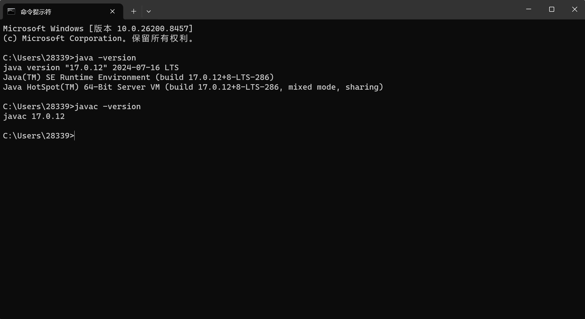

# task1 
## ans1
 - **jvm**:java虚拟机，能够识别.class格式的文件，负责把编译好的字节码转换成机器指令，屏蔽不同机器的差异，让程序员可以只编译一次.java文件就能在不同的机器上运行同样的程序，不然要在不同的机器上运行，就得为每种机器单独编译一次。除此之外还有管理内存、自动回收垃圾等功能。
 - **jre**：Java运行时环境，包含jvm、Java核心类库、运行支持工具等运行需要的基础环境。
 - **jdk**：Java开发工具包，包含jre和各种开发工具，要开发java程序必须安装jdk
 - 三者的关系：包含关系，jvm是jre的一部分，jre又是jdk的一部分。 
 ----
 ## ans2
##### jdk中有javac编译器，能把写好的java程序编译成字节码，jvm识别字节码文件，加载HelloJava.class,通过解释器和jit编译器将字节码变为机器码，最后交给cpu执行指令。

----
 ## ans4
 

 
