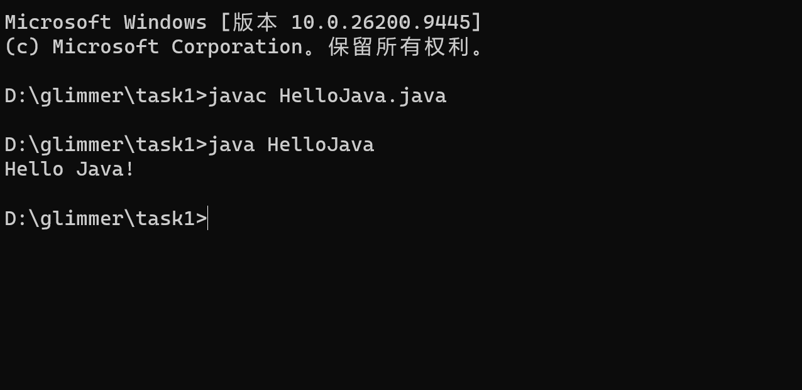

# task2
## ans1
我配置了Java_Home和path两个系统变量。
- Java_Home:我在系统变量里添加了Java_Home变量，它指定了jdk的位置，方便其他java工具配置环境变量。
#
- path：操作系统寻找可执行程序的目录，我在里面加上了包含java.exe和javac.exe的目录的地址，这样之后，当我在任意目录通过cmd调用这两个函数的时候，操作系统都能找到这两个程序。
----
## ans2
配置好环境变量后，在命令行调用这两个程序时，操作系统会在path变量里包含的目录里依次寻找这两个程序，因为我在path变量里加入了jdk\bin目录的地址，所以操作系统能在这个目录下找到java.exe和javac.exe,从而执行。

----

 ## ans4
 出现了HelloJava.java和HelloJava.class两个文件。
 * HelloJava.java是我自己用java语言写的程序，通过javac编译后能生成HelloJava.class文件。
 * HelloJava.class能被jvm识别并执行，最终输出结果。
 