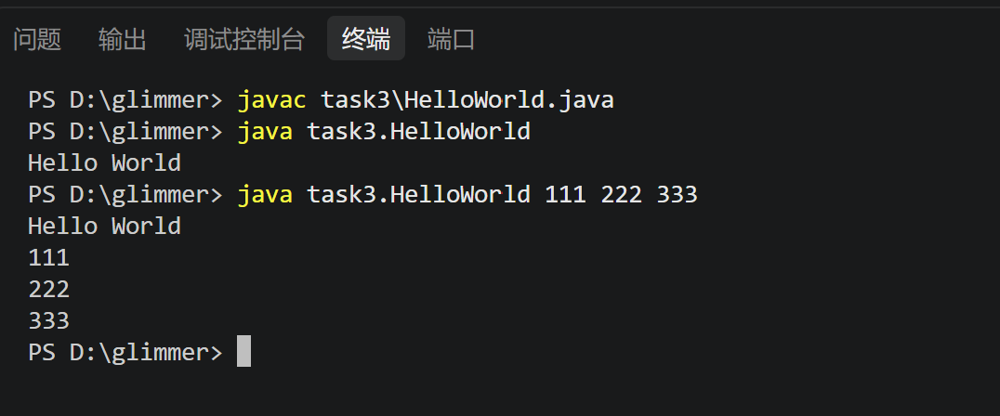

# task3
## ans1
4个部分。
- 第一部分是package task3;
它的作用是声明这个文件中的类所属的包。
- 第二个部分是import task3.tool.Print;
它的作用是告诉编译器之后出现的Print类指的是task3.tool.Print。
- 第三个部分是public class HelloWorld
它被public修饰，能让外界程序访问，其中包含的main（）函数是jvm启动程序的入口。
- 第四个部分是class Test
里面的test函数被static修饰，使Helloworld类可以不用创建Test类就能直接调用test函数。
-----
## ans2
- 包是什么？

包是一种命名空间，类似于虚拟目录，能对类进行分类组织。

- 为什么需要包？

1.便于对类进行分类，比如将工具类都放在tool包里，用户类都放在user包里。
2.解决命名冲突，比如有两个task都需要用到Helloword，可以分别放在task1、task2两个包中，调用时，可以用task1.Helloworld、task2.HelloWorld来区分。

----
## ans3
import的作用是什么？
可以在当前的文件中方便的调用别的文件里的类，import之后就不需要写完整的类名，可以只写最后一部分名字。

----
## ans4
main 方法为什么能作为程序入口？
java规定了jvm要在加载类后，找到其中叫做main的函数，并执行这个函数。public修饰词让外部程序有权限访问这个函数，static让外部程序不用先创建一个类的实体就能直接调用main函数。

----
## ans5
